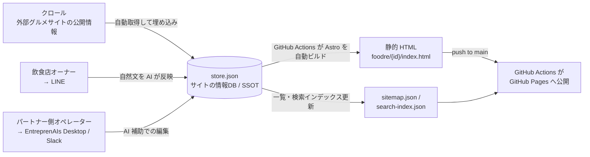

# EntreprenAIs Factory — ホームページ自動生成システム

> **EntreprenAIs Factory** は、店舗・地域などの **公開情報** から、多言語対応の静的ホームページを大量に自動生成して公開するシステムです。
> このリポジトリ（`taru0216/factory-entreprenais-com`）はそのまま **fork / clone して自由に利用** できます。
> 本ドキュメントは外部パートナーのエンジニア向けに、まず **「生成済みのホームページをどう使うか（ホスティング）」** を実践的に説明し、続いて全体像（仕組み・アーキテクチャ）を高レベルで説明します。

---

## 1. はじめに

### 1.1 EntreprenAIs とは

**EntreprenAIs** は、AI エージェントが開発・運用を担うプラットフォーム（経営 AI スタック）です。人手の代わりに AI エージェントがコードを書き、ビルドし、運用します。本 EntreprenAIs Factory も、その上で AI エージェントが構築・運用しているシステムの 1 つです。

### 1.2 EntreprenAIs Factory とは

**EntreprenAIs Factory** は、公開情報をクロール・正規化し、そこから多言語対応の静的ホームページを **大量に自動生成** するシステムです。生成対象は **カテゴリ** ごとに分かれており、本ドキュメント時点では次の 2 カテゴリがあります。

| カテゴリ識別子 | 対象 | 公開パス |
|--------------|------|---------|
| **`foodre`** | 飲食店 | `/foodre/{retty_id}/` |
| **`cities`** | 自治体（地域情報） | `/cities/{code}/` |

> つまり **システム全体の名称が EntreprenAIs Factory**、その中の **カテゴリの 1 つが `foodre`（飲食店）/ `cities`（自治体）** という関係です。`foodre` / `cities` は公開 URL のパスやデータの識別子として使われるカテゴリ名であり、システム名ではありません。

各ページの特徴:

- 生成物は **完全に自己完結した静的 HTML**（外部 CSS フレームワーク・JS フレームワーク非依存）。そのままどんな配信基盤にも載せられます。
- 情報は **1 ファイル 1 対象の `store.json`** に集約（Single Source of Truth）。HTML はこの JSON から生成されます。
- **多言語対応**（日本語に加え en / zh / ko / th / vi / zh-TW のフィールドを持つ）。

### 1.3 事例紹介

- **[ホームページ作成事例（ショーケース）](https://entreprenais.com/eai/showcase/)** — EntreprenAIs で作成したホームページの事例集
- **公開中の例**:
  - 飲食店カテゴリ 店舗一覧: https://factory.entreprenais.com/foodre/
  - 自治体カテゴリの例: https://factory.entreprenais.com/cities/32525/
- **目標とする基本デザイン**: https://entreprenais.com/sites/banwaen-ikebukuro/ — 現在の生成テンプレートは暫定品質であり、このサイトの完成度を基準に改良していきます（詳細は「9.1 デザイン方針」参照）。

### 1.4 この先の読み方

- **生成済みのホームページを「使うだけ」** なら → 次の「2. ホスティング方法（生成済みホームページの使い方）」だけで十分です。ビルド環境は不要です。
- **仕組み（どうやって生成しているか）を知りたい / 自前でクロール・ビルドを回したい** なら → 「3. 全体データフロー」以降のアーキテクチャ解説をご覧ください。

---

## 2. ホスティング方法（生成済みホームページの使い方）

EntreprenAIs Factory が生成する成果物は **完全に自己完結した静的 HTML/CSS** です。サーバもビルドも不要で、外部の CSS/JS フレームワークにも依存しません（読み込む外部リソースは Web フォントと写真の画像 CDN のみ）。そのため、**ファイルを置くだけ** で、どんな静的ホスティングでもすぐに公開できます。

このセクションは「生成物がどこにあって、どう公開するか」を最短で説明します。仕組み（クロールやビルドの内部）を知る必要はありません。

### 2.1 生成ファイルの場所

生成済みの HTML は、すべてこのリポジトリ内にコミット済みです。

| 用途 | パス |
|------|------|
| 各店舗ページ（foodre カテゴリ） | `foodre/{retty_id}/index.html` |
| 店舗一覧ページ（foodre カテゴリ） | `foodre/index.html` |
| 自治体ページ（cities カテゴリ） | `cities/{code}/index.html` |

- `{retty_id}` は店舗ごとの ID（10 桁以上の数字）、`{code}` は自治体コードです。
- これらはすべて **CI でビルド済みの成果物** であり、各 HTML はスタイルを `<style is:global>` にインライン化した自己完結ファイルです。サーバサイド処理・ビルドステップは一切不要です。
- 関連する `sitemap.json` / `search-index.json`（一覧・検索インデックス）もリポジトリ内に同梱されています。

### 2.2 取得方法

必要なのは **HTML ファイルを手元に持ってくる** ことだけです。以下のいずれかで取得できます。

```bash
# 方法1: リポジトリ全体を clone
git clone https://github.com/taru0216/factory-entreprenais-com.git
cd factory-entreprenais-com

# 方法2: GitHub 上で Fork（自分の組織/アカウントへコピー）して clone

# 最新の生成物に追従するには
git pull
```

公開に使うのは基本的に `foodre/` や `cities/`（必要なカテゴリ）ディレクトリだけです。一部の対象だけ使いたい場合は、該当する `foodre/{retty_id}/` ディレクトリだけ取り出しても構いません。

### 2.3 ホスティング例: Amazon S3（すぐ使える）

S3 の静的ウェブサイトホスティングに置く例です。バケットを用意して `foodre/` を同期するだけで公開できます。

```bash
# 1. バケット作成（リージョン・バケット名は適宜変更）
aws s3 mb s3://my-factory-site --region ap-northeast-1

# 2. 静的ウェブサイトホスティングを有効化（index ドキュメントを指定）
aws s3 website s3://my-factory-site/ --index-document index.html

# 3. 生成済み HTML を同期（foodre/ をそのままアップロード）
aws s3 sync foodre/ s3://my-factory-site/foodre/ --acl public-read
#   一覧:    http://my-factory-site.s3-website-ap-northeast-1.amazonaws.com/foodre/
#   各店舗:  .../foodre/{retty_id}/
```

> `--acl public-read` が無効化されたバケット（推奨設定）では、代わりにバケットポリシーで `s3:GetObject` を公開許可してください。独自ドメイン・HTTPS が必要な場合は CloudFront を前段に置きます。`cities/` を公開する場合も同様に `aws s3 sync cities/ s3://my-factory-site/cities/` で同期できます。

### 2.4 その他のホスティング選択肢

静的ファイルなので、**置くだけ** で動く配信基盤ならどれでも使えます（ビルド不要）。代表的な選択肢:

| 方法 | 概要 |
|------|------|
| **Netlify** | リポジトリを連携、または `foodre/` をドラッグ&ドロップ / `netlify deploy` でアップロードするだけ。 |
| **Cloudflare Pages** | リポジトリ連携、または `wrangler pages deploy foodre/` でアップロード。CDN/HTTPS が自動。 |
| **GitHub Pages** | リポジトリの Pages を有効化すれば、コミット済みの HTML がそのまま公開されます（本番サイトもこの方式）。 |
| **nginx / Apache 等の自前サーバ** | ドキュメントルートに `foodre/` を配置するだけ。例: `cp -r foodre /var/www/html/`。 |

> **ポイント**: いずれの場合も「生成済みの静的ファイルを配置するだけ」です。ランタイムやビルドパイプラインを用意する必要はありません。

### 2.5 自社サイトへの組み込み

独立した公開ではなく、既存の自社サイトに取り込みたい場合も、同じ静的ファイルをそのまま使えます。

- **サブパス配信**: 既存サイトの `/restaurants/` 等に `foodre/` の中身を配置する。
- **静的アセット取り込み**: 自社の静的サイトジェネレータ・CMS に HTML/画像を取り込む。
- **iframe 埋め込み**: 個別ページを既存ページ内に `<iframe>` で埋め込む（最も手軽だが SEO/レイアウト面では非推奨）。

> ページ内のリンクは `/foodre/...` を起点とした絶対パスです。別のサブパスに配置する場合は、配信側のリライト設定で吸収するか、パスの基点を調整してください。
>
> このほか、`store.json` スキーマだけを流用する・クロール&ビルド機構ごと再利用する、といった組み込み方も可能です。詳しくは「8. fork / clone / 組み込み手順」を参照してください。

---

> **ここから先はアーキテクチャ解説です。** 生成物を使うだけなら上記のホスティング方法で十分です。以降は「どうやってこの静的 HTML を生成しているか（クロール → SSOT → 自動ビルド → 公開）」の仕組みを説明します。

---

## 3. 全体データフロー

EntreprenAIs Factory の設計の核心は、**`store.json` をサイトの単一の情報源（SSOT）として中心に据える**ことです。
情報の入り口は 3 系統あり、**どの経路で入った情報も同じ `store.json` に集約**されます。
そして `store.json` の変更を起点に、**GitHub Actions が Astro を自動ビルド**して HP を生成・公開します。



テキストで表すと:

```
[クロール（外部グルメサイトの公開情報）]                  ┐
[飲食店オーナー → LINE]                                    ├→ store.json（情報DB / SSOT）→ GitHub Actions が Astro を自動ビルド → 公開HP
[パートナー側オペレーター → EntreprenAIs Desktop(Mac) / Slack] ┘
```

### 情報の入り口（3系統）

| 経路 | 入力手段 | 内容 |
|------|---------|------|
| **クロール** | 自動バッチ | 外部の情報サイト（飲食店ならグルメサイト）の公開情報を自動取得して `store.json` に埋め込む（`scripts/crawl_retty.py`）。公開ページのみが対象で、内部 API には一切アクセスしません。レートリミット配慮のため sleep を挟んだ夜間バッチ（GitHub Actions の `crawl-stores.yml`）で実行します。 |
| **オーナーによる直接入力** | **LINE** | 飲食店オーナー等が LINE で自然文を送ると、AI がその内容を `store.json` に反映します。メニュー・オーナーメッセージ・多言語フィールドなどを手軽に充実させられます。 |
| **パートナー側オペレーターによる直接入力** | **EntreprenAIs Desktop（Mac アプリ）または Slack** | パートナー内部のオペレーターが Desktop アプリまたは Slack から、AI 補助で `store.json` を編集します。 |

> **設計思想**: クロールによる自動取得だけでなく、人＋AI による直接編集（オーナーは LINE、パートナー内部は Desktop アプリ or Slack）も **すべて同じ `store.json` に集約**されます。入力手段は経路ごとに異なりますが、最終的な情報源は `store.json` ただ一つ（SSOT）であり、その変更を起点に GitHub Actions が自動ビルドする——という一貫した構造が、データの整合性と多店舗の大量生成を両立させています。

### ビルド・公開

- **HTML 生成（Astro 自動ビルド）は GitHub Actions が担います。** `store.json` を起点に、本リポジトリ同梱の Astro プロジェクト（`site-builder/`）を CI 上でビルドし、生成された静的 HTML を `foodre/`（自治体は `cities/`）にコミットします。手動でローカルにビルド環境を用意する必要はありません。
- **公開**は GitHub Actions（`deploy.yml`）が、`main` への push を起点に GitHub Pages へリポジトリのルートをそのままデプロイします。
- ワークフローの詳細は「7. ビルド・デプロイ（GitHub Actions）」を参照してください。

---

## 4. 公開 URL

| 用途 | URL |
|------|-----|
| 店舗一覧（foodre） | https://factory.entreprenais.com/foodre/ |
| 各店舗ページ（foodre） | https://factory.entreprenais.com/foodre/{retty_id}/ |
| 自治体ページ（cities） | https://factory.entreprenais.com/cities/{code}/ |

`{retty_id}` は店舗ごとの ID（10 桁以上の数字）、`{code}` は自治体コードです。

---

## 5. リポジトリ構成

リポジトリ: **[`taru0216/factory-entreprenais-com`](https://github.com/taru0216/factory-entreprenais-com)**（public・fork 可能）

```
factory-entreprenais-com/
├── foodre/                      # 生成された飲食店HP（静的 HTML・foodre カテゴリ）
│   └── {retty_id}/index.html    #   店舗ごとのページ
│   └── index.html               #   店舗一覧ページ
├── cities/                      # 生成された自治体HP（静的 HTML・cities カテゴリ）
├── stores/                      # store.json データ（SSOT）
│   ├── store.schema.json        #   store.json の JSON Schema（draft-07）
│   └── {NN}/{retty_id}/store.json  # 店舗データ（NN = retty_id 末尾2桁でシャーディング）
├── site-builder/                # Astro プロジェクト（store.json → 静的 HTML ビルド機構）
│   ├── astro.config.mjs         #   Astro 設定
│   ├── package.json             #   ビルド依存（GitHub Actions が npm ci で解決）
│   └── src/                     #   ページテンプレート・ビルドロジック
├── scripts/
│   ├── crawl_retty.py           # 公開サイトのクローラ（標準ライブラリのみで動作）
│   ├── build_one.sh             # 1 サイト（1 店舗 / 1 自治体）だけを単体ビルド
│   ├── update_sitemap.py        # sitemap.json / search-index.json 更新
│   └── validate_store.py        # store.json のスキーマ検証
├── .github/workflows/
│   ├── crawl-stores.yml         # 夜間クロール → store.json 生成・コミット
│   ├── build-site.yml           # 特定サイトを単体ビルド（手動 dispatch）
│   └── deploy.yml               # main への push で GitHub Pages 公開
├── CNAME                        # factory.entreprenais.com
└── .nojekyll
```

> **`stores/{NN}/`** の `NN` は `retty_id` の末尾2桁です。1 ディレクトリに数万件が並ぶのを避けるためのシャーディングで、深い意味はありません。

---

## 6. ビルド元データ: `store.json` スキーマ（要点）

生成される HTML の **元データ** が、各対象の `stores/{NN}/{retty_id}/store.json` に格納された **SSOT** です。HTML はすべてこの JSON から生成されます。正式なスキーマは [`stores/store.schema.json`](stores/store.schema.json)（JSON Schema draft-07）を参照してください。主なフィールドは以下のとおりです。

| フィールド | 型 | 説明 |
|-----------|-----|------|
| `retty_id` | string | 店舗 ID（10桁以上の数字）。**必須** |
| `slug` | string | URL 用スラッグ。**必須** |
| `hp_status` | string | HP 生成状態（`not_generated` / `generated` / `published` / `archived`）。**必須** |
| `name` | string | 店名。**必須** |
| `category` / `categories` | string / string[] | 主カテゴリ / 全カテゴリ |
| `address` / `postal_code` | string | 住所・郵便番号 |
| `tel` | string | 電話番号 |
| `hours` | object | 曜日別営業時間（`mon`..`sun` / `holiday` → `{open, close}`） |
| `budget` | object | 予算目安（`lunch` / `dinner`） |
| `geo` | object | 緯度・経度（`lat` / `lng`） |
| `nearest_station` | string | 最寄り駅 |
| `payment_accepted` | string | 支払い方法 |
| `photos`（`retty_photos` / `owner_photos`） | string[] | 写真 URL 群 |
| `reservation_url` / `sns` | string / object | 予約 URL・SNS リンク |
| `owner_message` / `featured_menu` / `special_info` | string / array | オーナー編集フィールド（任意に上書き可能） |
| `i18n` | object | 多言語フィールド（`en` / `zh` / `ko` / `th` / `vi` / `zh-TW`） |

> フィールドは「クロール由来」「オーナー編集」「多言語」の3系統に分かれます。`additionalProperties: true` なので、自社用途のフィールドを追加しても壊れません。

---

## 7. ビルド・デプロイ（GitHub Actions）

`store.json` → 静的 HTML の生成は **本リポジトリ同梱の Astro プロジェクト（`site-builder/`）を GitHub Actions が CI 上で自動ビルド**する方式です。ビルド設定（`site-builder/`）もワークフロー（`.github/workflows/`）もすべてこのリポジトリに同梱されているため、**fork すればそのまま同じパイプラインを自分のリポジトリで回せます**。

> 一方で、**生成物を「使うだけ」ならビルド環境は不要**です。`foodre/`（および `cities/`）配下の HTML は CI でビルド済みの成果物としてコミットされており、そのまま配信・組み込みできます（「2. ホスティング方法」参照）。

### 7.1 ワークフロー一覧

| ワークフロー | トリガー | 役割 |
|------------|---------|------|
| `crawl-stores.yml` | `schedule`（cron `0 18 * * *` = **03:00 JST** の夜間バッチ）+ `workflow_dispatch` | 外部グルメサイトの公開情報をクロールし `store.json` / `sitemap.json` / `search-index.json` を生成してコミット。レートリミット（HTTP 429）回避のため `sleep`（既定 5 秒）を挟む。`workflow_dispatch` の inputs: `area_url` / `max_count`（既定 2000）/ `sleep`（既定 5）。 |
| `build-site.yml` | `workflow_dispatch`（手動） | **特定サイトを 1 件だけ単体ビルド**して該当パスに反映する。全店フルビルドを回さずに 1 店舗 / 1 自治体だけを短時間で再生成するためのワークフロー。`site-builder/` の依存を `npm ci` で解決し、`scripts/build_one.sh` を実行。inputs: `site_type`（`foodre` / `cities`）/ `id`（`foodre` は `retty_id`、`cities` は自治体コード）。 |
| `deploy.yml` | `push`（`main` ブランチ）+ `workflow_dispatch` | リポジトリのルートをそのまま **GitHub Pages へデプロイ**して公開する。`crawl-stores.yml` / `build-site.yml` がコミットを `main` に push すると、本ワークフローが連鎖して公開まで到達する。 |

### 7.2 ビルドフロー

```
crawl-stores.yml（夜間 / 手動）
   └─ クロール → store.json 生成・コミット → main へ push
                                                   │
build-site.yml（手動・1 サイト単体）               │
   └─ site_type + id を指定 → 該当サイトだけ        │
      Astro ビルド → 該当パスをコミット → main へ push
                                                   ▼
                                            deploy.yml（push:main）
                                               └─ GitHub Pages へ公開
```

### 7.3 今後の拡張（設計済み）

- **自動インクリメンタルビルド**: `store.json` の変更を検知し、対応するサイトのみを自動でインクリメンタルビルドする。
- **フルビルドの sharding**: 全店フルビルドは **GitHub Actions の matrix によるシャーディング**で並列化し、対象数が増えても CI 時間を抑える。

> ビルドパイプラインの詳細・カスタマイズについてのご相談は、本リポジトリの Issue までお寄せください。

---

## 8. fork / clone / 組み込み手順

> ※ 本リポジトリは将来 **private 化を予定**しています（2026年8月以降を想定）。その際は「public を fork」する共有方法が使えなくなり、共有方法が変わります（詳細は「13. リポジトリ公開範囲と移行計画」参照）。

### 8.1 取得

```bash
# fork する場合: GitHub 上で Fork ボタン → 自分の組織/アカウントへ
# clone する場合:
git clone https://github.com/taru0216/factory-entreprenais-com.git
cd factory-entreprenais-com
```

最新の生成物・データを取り込むには `git pull` で十分です。

### 8.2 自社サイトへの組み込みパターン

用途に応じて、以下の 3 パターンから選べます（組み合わせも可）。

#### パターン A: 生成済みの静的 HTML をそのまま使う（最短）

`foodre/`（および `cities/`）配下の HTML は自己完結しています（スタイルは各ページの `<style is:global>` にインライン化され、外部 CSS/JS フレームワークに依存しません。読み込む外部リソースは Web フォントと写真の画像 CDN のみ）。そのため、どんな配信基盤にも載せられます。具体的なホスティング手順は「2. ホスティング方法（生成済みホームページの使い方）」を参照してください。

- **サブパス配信**: 既存サイトの `/restaurants/` 等に `foodre/` の中身を配置する。
- **静的アセット取り込み**: 自社の静的サイトジェネレータ・CMS に HTML/画像を取り込む。
- **iframe 埋め込み**: 個別ページを既存ページ内に `<iframe>` で埋め込む（最も手軽だが SEO/レイアウト面では非推奨）。

> ページ内のリンクは `/foodre/...` を起点とした絶対パスです。別のサブパスに配置する場合は、配信側のリライト設定で吸収するか、パスの基点を調整してください。

#### パターン B: `store.json` スキーマを流用する（データ駆動）

`stores/store.schema.json` を自社のデータモデルとして採用し、HTML 生成は自社のテンプレート/フレームワークで行うパターンです。

- 正規化済みスキーマ（営業時間・予算・多言語など）をそのまま利用できます。
- `scripts/validate_store.py` でスキーマ検証が可能です。
- デザインや機能を自社ブランドに合わせて完全に作り替えられます。

#### パターン C: クロール・ビルド機構を再利用する（フルパイプライン）

`scripts/crawl_retty.py`（クローラ・標準ライブラリのみ）、`site-builder/`（Astro プロジェクト）、GitHub Actions ワークフロー（`crawl-stores.yml` / `build-site.yml` / `deploy.yml`）を自社リポジトリに取り込み、クロール → 自動ビルド → 公開までを自前で回すパターンです。fork すればこのパイプライン一式がそのまま動きます。

- 対象エリア・更新頻度・公開先（自社 GitHub Pages 等）を自由に設定できます。
- クロールは公開ページのみを対象とし、レートリミット配慮の sleep を挟んだ夜間バッチ構成です。

---

## 9. 多言語・スタイル

- **多言語**: 各 `store.json` の `i18n`（`en` / `zh` / `ko` / `th` / `vi` / `zh-TW`）から、Astro が言語別のページ要素を生成します。初回クロール時点では空で、後から多言語フィールドを埋めると反映されます。
- **スタイル**: 生成 HTML は `<style is:global>` でスタイルを自己完結させています。外部 CSS フレームワークに依存しないため、移植・組み込みが容易です（外部からの読み込みは Web フォントと写真 CDN のみ）。

### 9.1 デザイン方針 / 目標とする基本デザイン

> **現状の注記**: 現在の生成テンプレートは **暫定品質** であり、今後デザインを改良していく予定です。本セクションは、その改良の指針となる「目標とする基本デザイン」を示すものです。

想定する基本デザインは、下記の banwaen-ikebukuro サイトのようなものです。今後の生成テンプレートは、このサイトの完成度（情報設計・余白・写真の見せ方・多言語の扱いなど）を基準に改良していきます。

- **目標デザイン例**: https://entreprenais.com/sites/banwaen-ikebukuro/

---

## 10. ライセンス・利用範囲

本リポジトリの **利用条件（ライセンス・再配布・商用利用の可否等）は別途ご相談ください。** 現時点では確定的なライセンスを定めていません。

> なお、各ページに含まれる写真・店舗情報など、第三者に権利が帰属するコンテンツの取り扱いについては、利用者側でも各権利元の利用規約をご確認ください。

---

## 11. 横展開について

同じ「公開情報クロール → SSOT(JSON) → 静的HP生成 → GitHub Pages 公開」の仕組みは、飲食店（`foodre`）以外のカテゴリ（例: 自治体 `cities`）にも展開可能です。新しいカテゴリの追加も、同じパイプライン上で行えます。

---

## 12. 関連リンク

- **[ホームページ作成事例（ショーケース）](https://entreprenais.com/eai/showcase/)** — EntreprenAIs で作成したホームページの事例集
- [`taru0216/factory-entreprenais-com`](https://github.com/taru0216/factory-entreprenais-com) — 本リポジトリ（public・fork 可能）

---

## 13. リポジトリ公開範囲と移行計画

### 13.1 現状（public）

本リポジトリは現在 **public** です。public で運用している理由は次の 2 点です。

1. **機密情報を含まない**: 格納しているのは店舗・自治体などの **公開情報**（クロール由来の情報・生成済み静的 HTML）のみであり、非公開情報を含みません。
2. **fork して試しやすい**: パートナーが「8. fork / clone / 組み込み手順」に沿って気軽に fork し、自社サイトへの組み込みを試せます。

### 13.2 方針（将来 private へ移行予定）

本リポジトリは将来 **private リポジトリへ移行する予定**です。

- **移行時期**: **2026年8月以降を想定**しています。それまでは public のまま運用し、fork も引き続き可能です。
- private 化は段階的に進める前提で、移行にあたっては以下の対応を計画しています。

### 13.3 移行時の対応（計画）

| 項目 | private 化後の対応 |
|------|------------------|
| **共有方法の変更** | 「public を fork」モデルは使えなくなります。private 化後は **コラボレーター招待 / ミラー配布 / アーカイブ（zip 等）提供** など、別の共有手段に切り替えます。 |
| **公開 Pages の継続** | 公開サイト（`factory.entreprenais.com`）を private リポジトリから配信するには、**private リポジトリの Pages 公開に対応したプラン（GitHub Pro / Team / Enterprise 等）** が必要です。移行時に対応プランを確認し、必要に応じて手当てします。 |
| **データの取り扱い** | private 化後は、オーナー / オペレーター入力など **非公開情報も格納しうる前提**で運用します（公開範囲が private に閉じるため、公開情報以外を扱えるようになります）。 |

> **補足**: 本セクションは公開範囲に関する **計画（予定）** の明文化です。実際の private 化の切り替えタイミングは別途案内します。

---

ご不明な点・組み込み方法のご相談は、本リポジトリの Issue またはお問い合わせ窓口までお寄せください。
